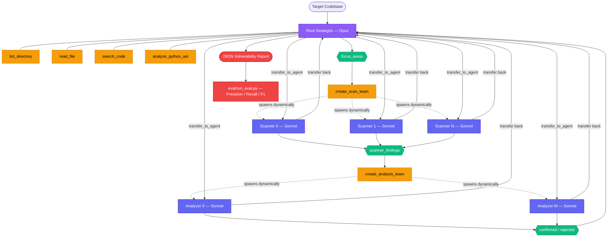
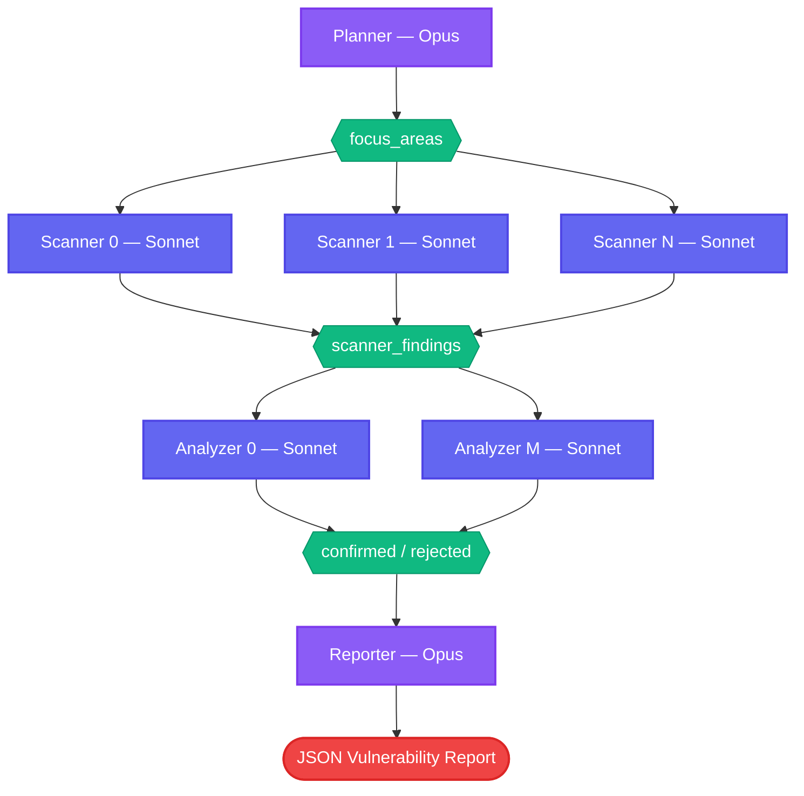

# vuln-discovery-agent

An LLM-based vulnerability discovery agent built with [Google's Agent
Development Kit (ADK)](https://google.github.io/adk-docs/) and
[Claude](https://docs.anthropic.com/en/docs/) models (Opus / Sonnet).

## Research goals

This project investigates whether a general-purpose LLM, given only
shell-like primitives and a disciplined audit methodology, can locate
exploitable vulnerabilities in Python web applications with useful
precision. The agent is deliberately denied high-level static
analyzers (Bandit, Semgrep, CodeQL): it has file reads, regex search,
AST introspection, directory listing, and a sandboxed Python
interpreter, and must reason about data flows itself.

Five design choices anchor the experiment:

1. **Shell-only tools.** Higher-level analyzers tend to anchor the
   agent on canned tool outputs and collapse its strategy space toward
   false positives. Restricting the tool surface to low-level
   primitives forces the model to compose its own detection approach.
2. **Dynamic multi-agent pipeline with model-tier specialisation.** An
   Opus strategist does reconnaissance and partitions the codebase,
   then dynamically spawns N Sonnet scanner sub-agents (one per focus
   area) and M Sonnet analyzer sub-agents (one per flag set). The
   number of sub-agents scales with codebase size, capped by
   `MAX_PARALLEL_SCANNERS` (default 6).
3. **Systematic data-flow reasoning.** Each agent's system prompt
   enforces trace-from-source-to-sink methodology that transfers
   across vulnerability classes (injection, traversal, template
   injection, broken access control, server-side request forgery).
4. **Restricted context with summarisation pivots.** A separate
   experiment (`eval/compaction_experiment.py`) periodically asks the
   agent to summarise its own trajectory and restarts the session with
   only that summary, modelling a bounded context regime.
5. **Precision over recall.** The system prompt instructs the agent to
   drop any finding it cannot fully justify by tracing the data flow.
   We treat false positives as a more expensive error than misses.

## Architecture

### Dynamic multi-agent mode (`adk web` / default)



The root agent (Opus) does reconnaissance, then calls `create_scan_team`
to dynamically inject N scanner sub-agents into the agent hierarchy. It
transfers to each scanner via ADK's native `transfer_to_agent` — every
sub-agent's tool calls and reasoning are **fully visible** in `adk web`.
After collecting scanner findings, it calls `create_analysis_team` to
spawn analyzer sub-agents for deep data-flow confirmation. Finally, the
root agent synthesises the report itself.

### CLI pipeline mode (`--pipeline`)



The CLI pipeline uses ADK's `ParallelAgent` for true concurrent
execution of scanners. Analyzers run sequentially per flag set. Both
planner and reporter use Opus; scanners and analyzers use Sonnet.

## Project layout

```
vuln-hawk/
├── vuln_agent/
│   ├── agent.py              # Dynamic multi-agent for `adk web`
│   ├── config.py             # Model config, backend selection, dotenv
│   ├── pipeline.py           # CLI pipeline with ParallelAgent
│   ├── agents/               # (reserved for future sub-agent modules)
│   ├── tools.py              # Shell-like tool primitives (5 tools)
│   ├── prompts.py            # System instructions for single-agent mode
│   └── report.py             # Parser for the agent's JSON output
├── sandbox/
│   └── Dockerfile            # Docker sandbox for run_python_snippet
├── targets/
│   ├── vulnerable_flask_app/ # 7 planted vulns + 10 false-positive traps
│   └── pygoat/               # OWASP PyGoat — real-world Django target
├── eval/
│   ├── ground_truth.json     # Labelled findings + traps (Flask app)
│   ├── run_eval.py           # End-to-end runner + precision/recall scorer
│   ├── compaction_experiment.py  # A/B comparison of trajectory compaction
│   └── results/
├── pyproject.toml
├── requirements.txt
├── .env.example
└── README.md
```

## Setup

```bash
uv venv && source .venv/bin/activate
uv sync
cp .env.example .env
# Add your Anthropic API key to .env
```

You'll need an `ANTHROPIC_API_KEY` in your `.env`. The agent defaults
to Claude Opus for the root strategist and Claude Sonnet for scanners
and analyzers. Override per role via `VULN_AGENT_SONNET_MODEL`,
`VULN_AGENT_OPUS_MODEL`.

### Configuration (.env)

| Variable | Default | Description |
|---|---|---|
| `ANTHROPIC_API_KEY` | (required) | Anthropic API key |
| `VULN_AGENT_BACKEND` | `anthropic` | `anthropic` (direct API) or `vertex` (Vertex AI) |
| `VULN_AGENT_OPUS_MODEL` | `claude-opus-4-6` | Model for root/planner/reporter |
| `VULN_AGENT_SONNET_MODEL` | `claude-sonnet-4-6` | Model for scanners/analyzers |
| `VULN_AGENT_MAX_SCANNERS` | `6` | Max parallel scanner sub-agents |
| `VULN_AGENT_SANDBOX` | `local` | `local` (subprocess) or `docker` (container) |
| `TARGET_CODEBASE_ROOT` | `targets/vulnerable_flask_app` | Path to target codebase |

For Vertex AI: set `VULN_AGENT_BACKEND=vertex` plus
`GOOGLE_CLOUD_PROJECT` / `GOOGLE_CLOUD_LOCATION`.

## Running the agent

**Interactive UI** (dynamic multi-agent, visible in `adk web`):

```bash
adk web
# select "vuln_discovery_agent" and send:
#   Audit the target codebase for vulnerabilities.
```

**CLI pipeline** (ParallelAgent for concurrent scanning):

```bash
python eval/run_eval.py --pipeline
```

**Against PyGoat** (OWASP Django target):

```bash
# Set TARGET_CODEBASE_ROOT=targets/pygoat in .env, then:
adk web
# or:
python eval/run_eval.py --target targets/pygoat --pipeline
```

**Score a previously saved report** (no API calls):

```bash
python eval/run_eval.py --no-run --report-file eval/results/report-<timestamp>.txt
```

**Compaction experiment** (A/B with trajectory summarisation):

```bash
python eval/compaction_experiment.py --every 10
```

## Target apps

### Bundled Flask app (7 planted vulns + 10 traps)

| ID | Class | File | What's wrong |
|----|-------|------|-------------|
| VULN-001 | SQL Injection | `db.py` | f-string interpolation into `cursor.execute` |
| VULN-002 | Command Injection | `utils.py` | user filename in `subprocess.run(..., shell=True)` |
| VULN-003 | Path Traversal | `upload.py` | `os.path.join(UPLOAD_DIR, filename)` without sanitisation |
| VULN-004 | SSTI | `app.py` | `render_template_string(f"...{user_message}...")` |
| VULN-005 | IDOR | `auth.py` | `login_required` checks session, not ownership |
| VULN-006 | Hardcoded Secret | `app.py` | `app.secret_key` and API key in source |
| VULN-007 | SSRF | `utils.py` | `requests.get(user_url)` with no allowlist |

Ten false-positive traps test whether the agent traces data flows or
falls back to syntactic pattern matching. See `eval/ground_truth.json`.

### PyGoat (OWASP)

Django-based intentionally vulnerable application with SQL injection,
command injection, XSS, XXE, SSRF, SSTI, insecure deserialization,
broken access control, and more across `introduction/views.py` and
related modules. No ground truth file yet — the agent discovers vulns
and we review manually.

## Results

### Bundled Flask app (multi-agent pipeline)

```
True positives:  7
False positives: 0
False negatives: 0
Precision:       1.000
Recall:          1.000
F1:              1.000
Traps triggered: 0
```

### PyGoat (OWASP Django app — dynamic multi-agent via `adk web`)

```
Findings:        17
Vuln classes:    10
Files covered:   4 (views.py, mitre.py, apis.py, settings.py)
```

| ID | Class | File | Function | Severity |
|----|-------|------|----------|----------|
| F1 | SQL Injection | views.py | sql_lab | CRITICAL |
| F2 | SQL Injection | views.py | injection_sql_lab | CRITICAL |
| F3 | Command Injection | views.py | cmd_lab | CRITICAL |
| F4 | Command Injection | views.py | cmd_lab2 (eval) | CRITICAL |
| F5 | Insecure Deserialization | views.py | insec_des_lab (pickle) | CRITICAL |
| F6 | XXE | views.py | xxe_parse | HIGH |
| F7 | Insecure Deserialization | views.py | a9_lab (yaml) | CRITICAL |
| F8 | Path Traversal | views.py | ssrf_lab | HIGH |
| F9 | SSRF | views.py | ssrf_lab2 | HIGH |
| F10 | SSTI | views.py | ssti_lab | HIGH |
| F11 | Command Injection | mitre.py | mitre_lab_25_api (eval, unauth) | CRITICAL |
| F12 | Command Injection | mitre.py | mitre_lab_17_api (nmap, unauth) | CRITICAL |
| F13 | Command Injection | apis.py | log_function_checker (file write) | CRITICAL |
| F14 | Command Injection | apis.py | A6_disscussion_api_2 (file write) | CRITICAL |
| F15 | Hardcoded Secret | settings.py | SECRET_KEY | CRITICAL |
| F16 | Hardcoded Secret | settings.py | SECRET_COOKIE_KEY (JWT) | HIGH |
| F17 | Hardcoded Secret | views.py | a1_broken_access_lab_3 | MEDIUM |

## Agent methodology

The root agent (Opus) follows a four-phase approach and can explain its
own reasoning. From the [PyGoat methodology walkthrough](eval/results/pygoat-methodology-20260516.md):

```
Reconnaissance    →  Read everything, identify all sinks
                     (breadth-first)

Scanning          →  Trace data flows for each sink
                     (depth-first, parallelized across N agents)

Verification      →  Confirm no mitigations exist globally
                     (search for sanitize/validate/escape = 0 results)

Reporting         →  Only include findings with complete
                     source→sink chains and working exploits
                     (precision over recall)
```

Key design behaviors observed during the PyGoat audit:

- **Adaptive team sizing**: Created 6 scanners grouped by file and vuln
  class so each had focused context (SQL sinks together, RCE sinks
  together, etc.)
- **Judgment calls on verification**: Skipped the analyzer phase when
  all flows were 1-2 steps with zero mitigations found globally — no
  point re-confirming the obvious.
- **Deliberate exclusions**: Did not flag `ImageMath.eval()` (version-
  dependent exploitability) or XSS (Django auto-escapes by default,
  would need template inspection to confirm). Documented reasoning for
  each exclusion.
- **Unauthenticated endpoints highlighted**: Noted that commented-out
  `@authentication_decorator` dramatically increases severity of
  otherwise-authenticated sinks.

## Open questions

- Per-class detection rate across different vuln classes
- False-positive trap rate and reasoning patterns behind errors
- Single-agent vs. multi-agent precision/recall comparison
- Effect of dynamic agent count on audit quality
- Effect of trajectory compaction on precision and recall
- Token efficiency: Opus strategist + Sonnet workers vs. single Opus
