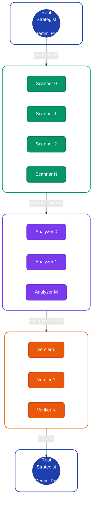
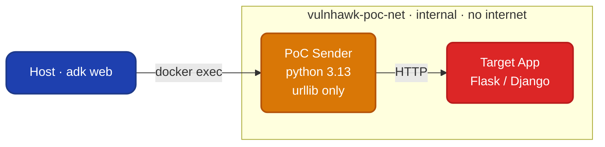
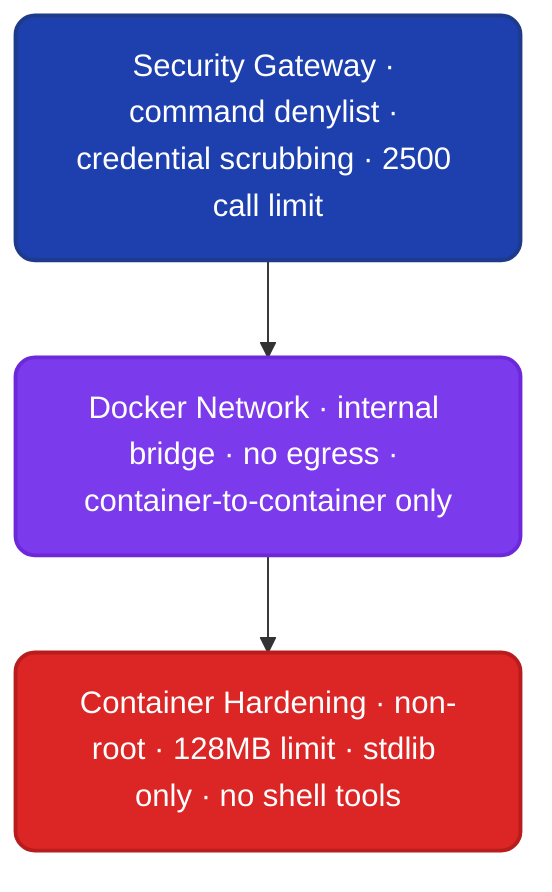

# vuln-hawk

An LLM-based vulnerability discovery agent built with [Google's Agent
Development Kit (ADK)](https://google.github.io/adk-docs/). Supports
[Gemini](https://ai.google.dev/gemini-api/docs/models) and
[Claude](https://docs.anthropic.com/en/docs/) models — configurable
per role.

## Research goals

This project investigates whether a general-purpose LLM, given only
shell-like primitives and a disciplined audit methodology, can locate
exploitable vulnerabilities in Python web applications with useful
precision. The agent is deliberately denied high-level static
analyzers (Bandit, Semgrep, CodeQL): it has file reads, regex search,
AST introspection, directory listing, and a sandboxed Python
interpreter, and must reason about data flows itself.

Five design choices anchor the experiment:

1. **Shell-only tools.** Restricting the tool surface to low-level
   primitives forces the model to compose its own detection approach.
2. **Dynamic multi-agent pipeline.** A root strategist partitions the
   codebase and spawns N scanner, M analyzer, and K verifier sub-agents
   at runtime. Agent count scales with codebase size.
3. **Systematic data-flow reasoning.** Each agent's prompt enforces
   trace-from-source-to-sink methodology across vulnerability classes.
4. **Live PoC validation.** Confirmed findings are validated by firing
   real HTTP requests from a sandboxed sender container against the
   target app running in an isolated Docker network.
5. **Precision over recall.** The agent drops any finding it cannot
   fully justify. False positives are a more expensive error than misses.

## Architecture

### 5-phase pipeline (`adk web`)



### How agent count is determined

Sub-agents are created **dynamically at runtime** — the number depends
on what the root agent discovers during reconnaissance:

| Phase | Agent type | How many? | What decides? |
|-------|-----------|-----------|---------------|
| 2 | Scanners | N (1–6) | One per focus area found in Phase 1. Root groups files by vulnerability class (e.g., SQL sinks together, RCE sinks together). Capped by `VULN_AGENT_MAX_SCANNERS` (default 6). |
| 3 | Analyzers | M (1–N) | One per scanner that raised flags. If a scanner found nothing, no analyzer is created for it. |
| 4 | Verifiers | K (1–M) | One per analyzer that confirmed findings. If an analyzer rejected all flags, no verifier is created. |

A small Flask app with 5 files might get 3 scanners, 2 analyzers, and
2 verifiers. PyGoat (80 files) got 6 scanners, 4 analyzers, and 3
verifiers. The root agent makes the grouping decision based on its
recon — it can merge related files into one scanner or split a large
file across multiple.

All sub-agents are injected into `root_agent.sub_agents` at runtime
and become visible in `adk web` via `transfer_to_agent`.

### Live PoC sandbox (when `VULN_AGENT_LIVE_POC=true`)



The host never sends HTTP to the target directly. All PoC traffic is
container-to-container inside the isolated Docker network.

### Security layers



Token usage is tracked per agent in the session state (visible in the
`adk web` State tab).

## Project layout

```
vuln-hawk/
├── vuln_agent/
│   ├── agent.py              # 5-phase multi-agent for adk web
│   ├── config.py             # Model config, backend, thinking, live PoC
│   ├── pipeline.py           # CLI pipeline with ParallelAgent
│   ├── target_manager.py     # Docker lifecycle for live PoC
│   ├── security.py           # Security gateway callbacks
│   ├── tools.py              # Shell-like tools + PoC tools
│   ├── prompts.py            # System instructions (single-agent mode)
│   └── report.py             # JSON report parser
├── sandbox/
│   ├── Dockerfile            # Code execution sandbox
│   └── Dockerfile.sender     # PoC sender sandbox
├── targets/
│   ├── vulnerable_flask_app/ # 8 planted vulns + 10 FP traps + Dockerfile
│   └── pygoat/               # OWASP PyGoat (Django) + Dockerfile
├── eval/
│   ├── ground_truth.json     # Labelled findings + traps
│   ├── run_eval.py           # Precision / recall / F1 scorer
│   ├── compaction_experiment.py
│   └── results/
├── docker-compose.yml        # Manual testing setup
├── pyproject.toml
├── .env.example
└── README.md
```

## Setup

```bash
uv venv && source .venv/bin/activate
uv sync
cp .env.example .env
# Add your API key(s) to .env
```

### Configuration (.env)

| Variable | Default | Description |
|---|---|---|
| **Provider** | | |
| `GOOGLE_API_KEY` | | Google AI API key (for Gemini) |
| `ANTHROPIC_API_KEY` | | Anthropic API key (for Claude) |
| `VULN_AGENT_BACKEND` | `anthropic` | Default backend for Claude models |
| **Per-role models** | | |
| `VULN_AGENT_ROOT_MODEL` | `claude-opus-4-6` | Root strategist |
| `VULN_AGENT_SCANNER_MODEL` | `claude-sonnet-4-6` | Scanner sub-agents |
| `VULN_AGENT_ANALYZER_MODEL` | `claude-sonnet-4-6` | Analyzer sub-agents |
| `VULN_AGENT_VERIFIER_MODEL` | `claude-sonnet-4-6` | Verifier sub-agents |
| **Thinking** | | |
| `VULN_AGENT_THINKING_LEVEL` | | Gemini: `MINIMAL` / `LOW` / `MEDIUM` / `HIGH` |
| `VULN_AGENT_THINKING_BUDGET` | | Token budget (both providers) |
| **Live PoC** | | |
| `VULN_AGENT_LIVE_POC` | `false` | Enable live exploit validation |
| `VULN_AGENT_POC_TIMEOUT` | `10` | HTTP request timeout (seconds) |
| `VULN_AGENT_POC_STARTUP_TIMEOUT` | `60` | Target health check timeout |
| **Pipeline** | | |
| `VULN_AGENT_MAX_SCANNERS` | `6` | Max scanner sub-agents |
| `VULN_AGENT_SANDBOX` | `local` | `local` or `docker` for code execution |
| `TARGET_CODEBASE_ROOT` | `targets/vulnerable_flask_app` | Target codebase path |

Model strings starting with `gemini-` auto-route to Google AI.
All others use the configured backend.

**All Gemini example:**
```
GOOGLE_API_KEY=your-key
VULN_AGENT_ROOT_MODEL=gemini-2.5-pro
VULN_AGENT_SCANNER_MODEL=gemini-2.5-flash
VULN_AGENT_ANALYZER_MODEL=gemini-2.5-flash
VULN_AGENT_VERIFIER_MODEL=gemini-2.5-flash
VULN_AGENT_THINKING_BUDGET=8192
```

**All Claude example:**
```
ANTHROPIC_API_KEY=your-key
VULN_AGENT_ROOT_MODEL=claude-opus-4-6
VULN_AGENT_SCANNER_MODEL=claude-sonnet-4-6
VULN_AGENT_ANALYZER_MODEL=claude-sonnet-4-6
VULN_AGENT_VERIFIER_MODEL=claude-sonnet-4-6
```

## Running the agent

**Interactive UI** (5-phase multi-agent, visible in `adk web`):

```bash
adk web
# select "vuln_discovery_agent" and send:
#   Audit the target codebase for vulnerabilities.
```

**With live PoC validation** (requires Docker):

```bash
# Set VULN_AGENT_LIVE_POC=true in .env, then:
adk web
```

**CLI pipeline** (ParallelAgent for concurrent scanning):

```bash
python eval/run_eval.py --pipeline
```

**Against PyGoat**:

```bash
# Set TARGET_CODEBASE_ROOT=targets/pygoat in .env, then:
adk web
```

**Docker Compose** (manual testing):

```bash
docker compose up -d                   # Flask target + sender
docker compose --profile pygoat up -d  # PyGoat instead
docker compose down                    # cleanup
```

## Target apps

### Bundled Flask app (8 vulns + 10 traps)

| ID | Class | File | What's wrong |
|----|-------|------|-------------|
| VULN-001 | SQL Injection | `db.py` | f-string interpolation into `cursor.execute` |
| VULN-002 | Command Injection | `utils.py` | user filename in `subprocess.run(..., shell=True)` |
| VULN-003 | Path Traversal | `upload.py` | `os.path.join(UPLOAD_DIR, filename)` without sanitisation |
| VULN-004 | SSTI | `app.py` | `render_template_string(f"...{user_message}...")` |
| VULN-005 | IDOR | `auth.py` | `login_required` checks session, not ownership |
| VULN-006a | Hardcoded Secret | `app.py` | `app.secret_key` hardcoded in source |
| VULN-006b | Hardcoded Secret | `app.py` | API key `sk-live-...` hardcoded in CONFIG |
| VULN-007 | SSRF | `utils.py` | `requests.get(user_url)` with no allowlist |

Ten false-positive traps test whether the agent traces data flows or
falls back to syntactic pattern matching. See `eval/ground_truth.json`.

### PyGoat (OWASP)

Django-based intentionally vulnerable application with SQL injection,
command injection, XSS, XXE, SSRF, SSTI, insecure deserialization,
broken access control, and more. No ground truth file yet — the agent
discovers vulns and we review manually.

## Results

### Bundled Flask app — model comparison (8 vulns, 10 traps)

| Metric | Claude Opus 4.6 | Gemini 3.1 Pro |
|---|---|---|
| True positives | 7 | 8 |
| False positives | 0 | 0 |
| False negatives | 1 | 0 |
| Traps triggered | 0 | 0 |
| Precision | 1.000 | 1.000 |
| Recall | 0.875 | 1.000 |
| F1 | 0.933 | 1.000 |

Both models avoided all 10 false-positive traps.

### Bundled Flask app — live PoC validation

All 5 testable exploits confirmed via sandboxed sender container:

| Vuln | PoC | Proof |
|---|---|---|
| SQL Injection | `GET /search?q=%27%20OR%20%271%27%3D%271` | All 3 users dumped |
| SSTI | `GET /error?msg={{7*7}}` | Response: `49` |
| Command Injection | `POST /convert {"filename":"x; echo PWNED"}` | `PWNED` in stdout |
| Path Traversal | `GET /download?filename=../../../../etc/passwd` | `/etc/passwd` contents |
| SSRF | `GET /preview?url=http://localhost:5000/healthz` | Internal endpoint fetched |

### PyGoat — 17 findings across 10 vuln classes

| ID | Class | File | Function | Severity |
|----|-------|------|----------|----------|
| F1 | SQL Injection | views.py | sql_lab | CRITICAL |
| F2 | SQL Injection | views.py | injection_sql_lab | CRITICAL |
| F3 | Command Injection | views.py | cmd_lab | CRITICAL |
| F4 | Command Injection | views.py | cmd_lab2 (eval) | CRITICAL |
| F5 | Insecure Deserialization | views.py | insec_des_lab (pickle) | CRITICAL |
| F6 | XXE | views.py | xxe_parse | HIGH |
| F7 | Insecure Deserialization | views.py | a9_lab (yaml) | CRITICAL |
| F8 | Path Traversal | views.py | ssrf_lab | HIGH |
| F9 | SSRF | views.py | ssrf_lab2 | HIGH |
| F10 | SSTI | views.py | ssti_lab | HIGH |
| F11 | Command Injection | mitre.py | mitre_lab_25_api (eval, unauth) | CRITICAL |
| F12 | Command Injection | mitre.py | mitre_lab_17_api (nmap, unauth) | CRITICAL |
| F13 | Command Injection | apis.py | log_function_checker (file write) | CRITICAL |
| F14 | Command Injection | apis.py | A6_disscussion_api_2 (file write) | CRITICAL |
| F15 | Hardcoded Secret | settings.py | SECRET_KEY | CRITICAL |
| F16 | Hardcoded Secret | settings.py | SECRET_COOKIE_KEY (JWT) | HIGH |
| F17 | Hardcoded Secret | views.py | a1_broken_access_lab_3 | MEDIUM |

## Agent methodology

The root agent follows a five-phase approach. From the
[PyGoat methodology walkthrough](eval/results/pygoat-methodology-20260516.md):

```
Phase 1  Reconnaissance    Read everything, identify all sinks
Phase 2  Scanning           Trace data flows per sink (N agents)
Phase 3  Deep Analysis      Confirm/reject with PoC proof (M agents)
Phase 4  Verification       Independent review + live PoC (K agents)
Phase 5  Final Report       Only VERIFIED findings with proof
```

Key design behaviors:

- **Adaptive team sizing**: Scanner count scales with codebase complexity
- **Independent verification**: Verifiers re-trace data flows from scratch
  and can mark findings VERIFIED, DISPUTED, or INVALID
- **Live PoC**: Real HTTP requests fired from sandboxed container,
  response proves (or disproves) exploitability
- **Deliberate exclusions**: Documents why certain patterns were NOT
  flagged (e.g., version-dependent, auto-escaped by framework)

## Open questions

- Per-class detection rate across different vuln classes
- False-positive trap rate and reasoning patterns behind errors
- Effect of dynamic agent count on audit quality
- Effect of trajectory compaction on precision and recall
- Token efficiency across model configurations
- Live PoC validation rate: what fraction of static findings are
  confirmed by live testing?
