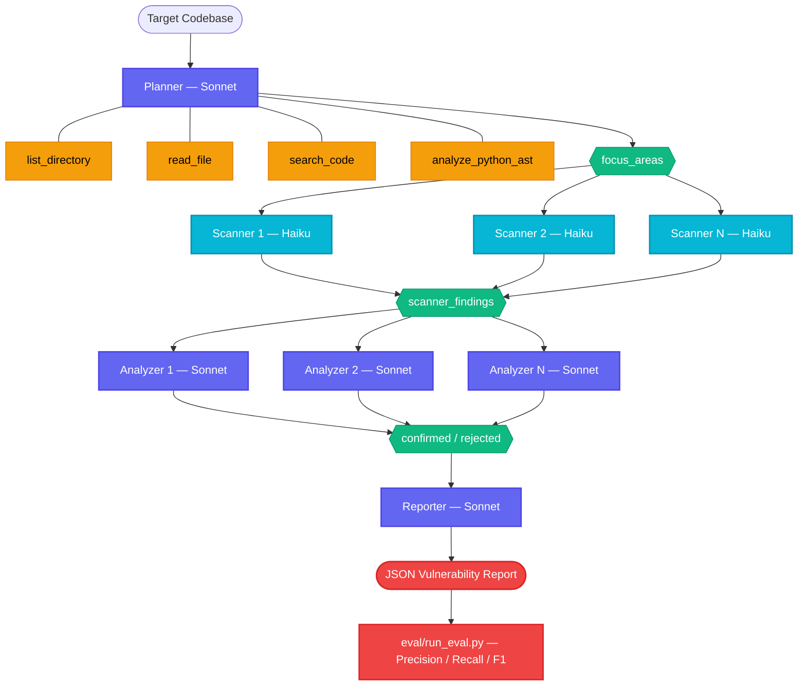
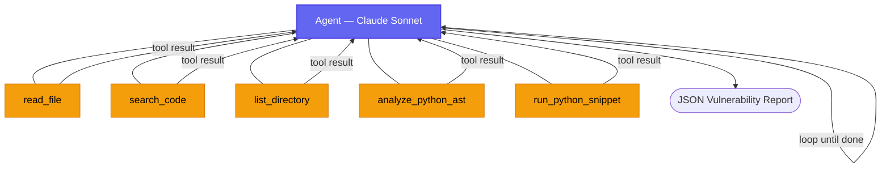

# vuln-discovery-agent

An LLM-based vulnerability discovery agent built with [Google's Agent
Development Kit (ADK)](https://google.github.io/adk-docs/) and
[Claude](https://docs.anthropic.com/en/docs/) models (Sonnet / Haiku).

## Research goals

This project investigates whether a general-purpose LLM, given only
shell-like primitives and a disciplined audit methodology, can locate
exploitable vulnerabilities in Python web applications with useful
precision. The agent is deliberately denied high-level static
analyzers (Bandit, Semgrep, CodeQL): it has file reads, regex search,
AST introspection, directory listing, and a sandboxed Python
interpreter, and must reason about data flows itself.

Five design choices anchor the experiment:

1. **Shell-only tools.** Higher-level analyzers tend to anchor the
   agent on canned tool outputs and collapse its strategy space toward
   false positives. Restricting the tool surface to low-level
   primitives forces the model to compose its own detection approach.
2. **Multi-agent pipeline with model-tier specialisation.** A Sonnet
   planner identifies focus areas, parallel Haiku scanners fast-triage
   each file, Sonnet analyzers perform deep data-flow confirmation,
   and a Sonnet reporter synthesises the final report. Each sub-agent
   operates in a focused context window scoped to its assignment.
3. **Systematic data-flow reasoning.** Each agent's system prompt
   enforces trace-from-source-to-sink methodology that transfers
   across vulnerability classes (injection, traversal, template
   injection, broken access control, server-side request forgery).
4. **Restricted context with summarisation pivots.** A separate
   experiment (`eval/compaction_experiment.py`) periodically asks the
   agent to summarise its own trajectory and restarts the session with
   only that summary, modelling a bounded context regime.
5. **Precision over recall.** The system prompt instructs the agent to
   drop any finding it cannot fully justify by tracing the data flow.
   We treat false positives as a more expensive error than misses.

## Architecture

### Multi-agent pipeline (`--pipeline`)



### Single-agent mode (`adk web` / default eval)



## Project layout

```
vuln-discovery-agent/
├── vuln_agent/
│   ├── agent.py              # Single-agent entry point for `adk web`
│   ├── config.py             # Model config (Sonnet/Haiku/Opus, env var overrides)
│   ├── pipeline.py           # Host-driven multi-agent orchestration
│   ├── agents/
│   │   ├── planner.py        # Sonnet: recon + attack surface mapping
│   │   ├── scanner.py        # Haiku: fast per-file triage (parallel)
│   │   ├── analyzer.py       # Sonnet: deep data-flow confirmation (parallel)
│   │   └── reporter.py       # Sonnet: synthesise final JSON report
│   ├── tools.py              # Shell-like tool primitives (5 tools)
│   ├── prompts.py            # System instruction for single-agent mode
│   └── report.py             # Parser for the agent's JSON output
├── targets/
│   └── vulnerable_flask_app/ # 7 planted vulns + 10 false-positive controls
├── eval/
│   ├── ground_truth.json     # Labelled findings + traps
│   ├── run_eval.py           # End-to-end runner + precision/recall scorer
│   ├── compaction_experiment.py  # A/B comparison of trajectory compaction
│   └── results/
├── pyproject.toml
├── requirements.txt
├── .env.example
└── README.md
```

## Setup

```bash
uv venv && source .venv/bin/activate
uv sync
cp .env.example .env
# Add your Anthropic API key to .env, then:
export $(grep -v '^#' .env | xargs)
```

You'll need an `ANTHROPIC_API_KEY` in your environment. The pipeline
defaults to Claude Sonnet 4.6 for planning/analysis and Claude Haiku
4.5 for scanning. Override per role via `VULN_AGENT_SONNET_MODEL`,
`VULN_AGENT_HAIKU_MODEL`, or `VULN_AGENT_OPUS_MODEL`.

For Vertex AI users: `pip install ".[vertex]"` and set
`GOOGLE_CLOUD_PROJECT` / `GOOGLE_CLOUD_LOCATION` instead.

## Running the agent

**Interactive UI** (single Sonnet agent, step through tool calls):

```bash
adk web
# select "vuln_discovery_agent" in the UI and send:
#   Audit the target codebase for vulnerabilities.
```

**Single-agent evaluation** (one Sonnet agent, all phases):

```bash
python eval/run_eval.py
```

**Multi-agent pipeline** (Planner → Haiku scanners → Sonnet analyzers → Reporter):

```bash
python eval/run_eval.py --pipeline
```

**Score a previously saved report** (no API calls):

```bash
python eval/run_eval.py --no-run --report-file eval/results/report-<timestamp>.txt
```

**Compaction experiment** (A/B with trajectory summarisation):

```bash
python eval/compaction_experiment.py --every 10
```

## Target app: planted vulnerabilities

| ID       | Class             | File         | What's wrong                                                          |
| -------- | ----------------- | ------------ | --------------------------------------------------------------------- |
| VULN-001 | SQL Injection     | `db.py`      | f-string interpolation into `cursor.execute`                          |
| VULN-002 | Command Injection | `utils.py`   | user filename interpolated into `subprocess.run(..., shell=True)`     |
| VULN-003 | Path Traversal    | `upload.py`  | `os.path.join(UPLOAD_DIR, request.args["filename"])` without sanitisation |
| VULN-004 | SSTI              | `app.py`     | `render_template_string(f"...{user_message}...")`                     |
| VULN-005 | IDOR              | `auth.py`    | `login_required` checks session, not resource ownership               |
| VULN-006 | Hardcoded Secret  | `app.py`     | `app.secret_key` and an API key embedded in source                    |
| VULN-007 | SSRF              | `utils.py`   | `requests.get(user_url)` with no allowlist                            |

## False-positive traps

Ten functions across the same files exhibit syntactic patterns
associated with vulnerabilities but are not exploitable: parameterized
queries, `secure_filename`-sanitised paths, hardcoded subprocess
arguments, session-derived user IDs, `render_template_string` invoked
with Jinja2 context variables, and similar. They exist to measure
whether the agent traces data flows to the source or falls back to
syntactic pattern matching on sink names. See `eval/ground_truth.json`
for the full list.

## Results

To be filled in after running the evaluation. Run
`python eval/run_eval.py` and record the scorecard here.

```
True positives:  ?
False positives: ?
False negatives: ?
Precision:       ?
Recall:          ?
F1:              ?
Traps triggered: ?
```

## Open questions

The evaluation harness is designed to answer the following:

- Per-class detection rate: does the agent perform comparably across
  straightforward sinks (SQL injection, command injection) and
  semantically subtle classes (IDOR, server-side template injection)?
- False-positive trap rate: which trap functions, if any, does the
  agent misclassify, and what reasoning pattern produced the error?
- Single-agent vs. pipeline: does the multi-agent architecture (Haiku
  scanners + Sonnet analyzers) improve precision or recall compared
  to a single Sonnet agent doing the full audit?
- Model-tier allocation: is Haiku adequate for the fast-scan phase,
  or does it miss flags that Sonnet would have caught?
- Effect of trajectory compaction: does periodic self-summarisation
  improve, preserve, or degrade precision and recall relative to an
  uncompacted baseline?
- Tool-call efficiency: how does the number of tool invocations
  correlate with final audit quality?
